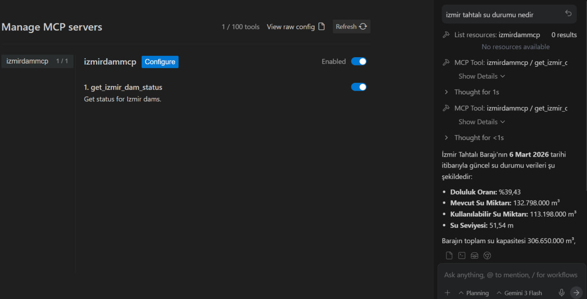

# IzmirDamMcp

IzmirDamMcp is a FastMCP server that provides daily water status and occupancy rates for dams in Izmir, Turkey. It fetches data from the official IZSU API. 



This project is built using `mcp` (FastMCP) and is intended to be deployed on `https://izmir-dam-mcp.vercel.app/mcp` using [Vercel](https://vercel.com).

## Tools
- `get_izmir_dam_status(date: str, dam_name: str)`: Returns the JSON data containing dam information for the specified date and optionally filtered by dam name.

## Installation
```bash
git clone https://github.com/bariskisir/IzmirDamMcp
cd IzmirDamMcp
pip install -r requirements.txt
```

## Usage
```bash
python api/server.py
```

## Adding to Clients

### 1. Antigravity
To use this MCP server in Antigravity, add the following to your `mcp_config.json`:

```json
{
  "mcpServers": {
    "izmirdammcp": {
      "serverUrl": "https://izmir-dam-mcp.vercel.app/mcp",
      "headers": {
        "Content-Type": "application/json"
      }
    }
  }
}
```

### 2. Claude Code
You can add the remote SSE server to Claude Code via the CLI:
```bash
claude mcp add izmirdammcp sse --url https://izmir-dam-mcp.vercel.app/mcp
```

